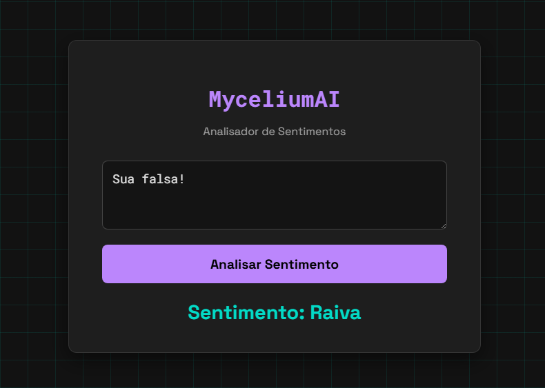

# MyceliumAI: Uma Arquitetura de Rede Neural de Grafo

**Uma arquitetura de IA para NLP, com camadas customizadas, construída do zero em TensorFlow.js e treinada em um computador de 2011 para provar que a engenhosidade supera as limitações de hardware.**



---

### Sobre o Projeto

Olá! Eu sou Cássio, um desenvolvedor brasileiro de 16 anos apaixonado por Inteligência Artificial. Este repositório documenta a minha jornada na criação de uma arquitetura de rede neural customizada, a **MyceliumAI**.

Inspirada na forma como os micélios de fungos criam redes interconectadas, a MyceliumAI abandona a estrutura sequencial tradicional em favor de um **grafo computacional** onde a informação flui por rotas paralelas e se reencontra, permitindo um processamento mais rico e complexo.

O coração da arquitetura são duas classes customizadas construídas sobre o TensorFlow.js:
- **`No.js`**: Atua como um centro de processamento que agrega e transforma informações de múltiplas fontes.
- **`Caminho.js`**: Representa as conexões ponderadas e treináveis que formam a "rede" entre os nós.

Este projeto foi um desafio pessoal para explorar os limites do que é possível com recursos limitados, e o resultado é um pipeline de Machine Learning completo, desde a limpeza de dados até a implantação de um modelo funcional em uma aplicação web.

### O Projeto Final: Analisador de Sentimentos

A versão mais avançada neste repositório é um **Analisador de Sentimentos** para o português. O modelo foi treinado com a arquitetura MyceliumAI e uma camada de **Word Embeddings** para entender o significado e o contexto das palavras, sendo capaz de classificar frases em 9 categorias de emoções.

### Como Executar o Projeto

Siga os passos abaixo para preparar os dados, treinar o modelo e testar a aplicação web final.

**Pré-requisitos:**
- [Node.js](https://nodejs.org/) (versão 20 ou superior) instalado.
- Um navegador web moderno.

**Passo 1: Instalar as Dependências**
Clone o repositório e, no terminal, dentro da pasta do projeto, execute:
```bash
npm install
```

**Passo 2: Preparar os Dados**
O script `preparar_dados.js` lê o dataset original (`dataset_sentimentos.json`), corrige erros comuns, remove dados inválidos e salva um arquivo limpo e pronto para o treino.
```bash
node preparar_dados.js
```
Isso criará o arquivo `dataset_para_treino.json`.

**Passo 3: Treinar o Modelo**
Agora, execute o script de treinamento principal. Ele usará o dataset limpo para treinar a MyceliumAI. Ao final, ele criará automaticamente a pasta `app_web/` com o modelo treinado (`model.json`, `weights.bin`) e o vocabulário (`vocab.json`).
```bash
node treinar_micelial.js
```

**Passo 4: Testar na Interface Web**
Após o treinamento, a sua aplicação estará pronta dentro da pasta `app_web/`.
1.  Garanta que você tem a extensão **Live Server** no Visual Studio Code.
2.  Clique com o botão direito no arquivo `index.html` que está **dentro da pasta `app_web/`**.
3.  Selecione "Open with Live Server".

A página carregará o modelo e estará pronta para analisar suas frases!

### Estrutura do Repositório

-   `/app_web/`: Contém a aplicação web final e autossuficiente.
    -   `index.html`: A interface para testar o modelo.
    -   `model.json`, `weights.bin`, `vocab.json`: O cérebro da IA, gerado pelo script de treino.
-   `no.js` / `caminho.js`: As classes fundamentais da arquitetura MyceliumAI.
-   `preparar_dados.js`: Script utilitário para limpar e validar o dataset.
-   `treinar_micelial.js`: **O script principal.** Orquestra todo o processo de treinamento e salvamento.
-   `dataset_sentimentos.json`: O dataset original.
-   `dataset_para_treino.json`: O dataset limpo, gerado para o treinamento.
-   `package.json`: Lista as dependências do projeto.

### Contato

- **Autor:** Cássio Rodrigues Alves
- **GitHub:** `https://github.com/Cassio-Rodrigues-Alves`
- **LinkedIn:** `https://www.linkedin.com/in/c%C3%A1ssio-rodrigues-alves-640704371/`

### Licença

Este projeto está licenciado sob a **Licença MIT**. Sinta-se à vontade para usar, aprender e construir sobre ele.