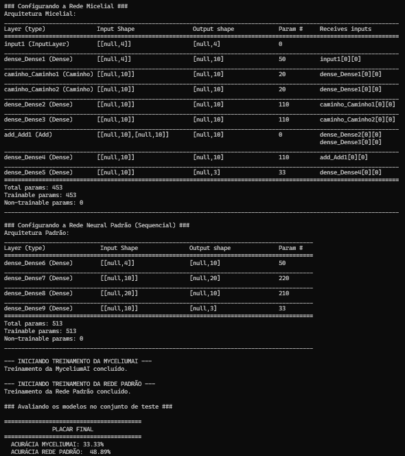

# MyceliumAI - Laboratório de Validação: Íris, Dropout e Duelos

    

Esta pasta representa um capítulo crucial na pesquisa e desenvolvimento da arquitetura **MyceliumAI**. Após o sucesso inicial com a análise de sentimentos, o foco se voltou para o refinamento e a validação rigorosa do modelo.

### A Jornada de Pesquisa

O trabalho nesta fase seguiu um processo científico de observação, hipótese e experimentação.

#### 1. O Diagnóstico: Overfitting
A análise do treinamento do analisador de sentimentos (Fase 3) revelou um problema clássico de Machine Learning: **overfitting**. O modelo estava se tornando excelente nos dados de treino, mas sua performance em dados de validação (não vistos) estagnava. Isso indicava que ele estava "decorando" em vez de "aprender a generalizar".

#### 2. A Hipótese e a Ferramenta: Regularização com Dropout
A hipótese foi que a alta complexidade da arquitetura de grafo da MyceliumAI, quando aplicada a um dataset de tamanho moderado, necessitava de técnicas de regularização. A ferramenta escolhida para combater isso foi o **Dropout**, uma técnica que "desliga" neurônios aleatoriamente durante o treino para forçar o aprendizado de padrões mais robustos.

Para implementar isso, a classe `No.js` foi aprimorada, transformando-se em um container flexível capaz de abrigar múltiplas camadas do TensorFlow.js, incluindo o Dropout.

#### 3. O Campo de Testes: Validação no Dataset Íris
Antes de aplicar a nova e complexa solução de volta ao problema demorado de NLP, foi decidido validar a eficácia do Dropout em um ambiente mais simples, rápido e controlado: o clássico **dataset de flores Íris**. O script `treinar_iris.js` foi criado para este fim.

#### 4. A Descoberta Inesperada: O Duelo de Arquiteturas
Durante a validação, surgiu uma nova pergunta: "A MyceliumAI, mesmo com Dropout, é a ferramenta certa para um problema tão bem-definido como o Íris?".

Para responder a isso, foi criado o experimento `comparar_arquiteturas.js`. Ele colocou a MyceliumAI para lutar "mano a mano" contra uma rede neural sequencial padrão de porte similar, usando os mesmos dados. O resultado foi surpreendente: a rede sequencial mais simples obteve uma acurácia superior.

### Conclusão e Aprendizado Principal

A conclusão desta fase de pesquisa foi dupla e extremamente valiosa:
1.  **O Dropout é uma ferramenta viável** para ser integrada na arquitetura MyceliumAI, e a classe `No.js` aprimorada é um sucesso.
2.  **O Princípio da Navalha de Occam:** A complexidade de uma arquitetura deve ser adequada à complexidade do problema. A MyceliumAI, por ser uma "Ferrari", não era a ferramenta mais eficiente para a tarefa simples de "ir à padaria" do dataset Íris. Seu verdadeiro potencial reside em problemas mais complexos, como a análise de nuances na linguagem natural.

Este capítulo não terminou com uma simples "vitória" de acurácia, mas com um **ganho de sabedoria** sobre quando e como aplicar diferentes arquiteturas de IA.

### Como Executar os Experimentos

-   **Para testar a implementação do Dropout:**
    ```bash
    node treinar_iris.js
    ```
-   **Para replicar o duelo de arquiteturas:**
    ```bash
    node comparar_arquiteturas.js
    ```
